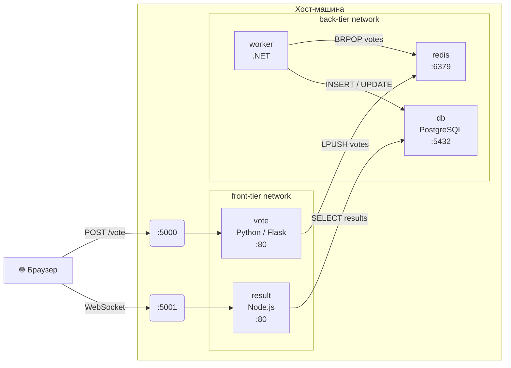
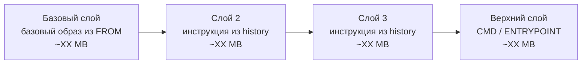
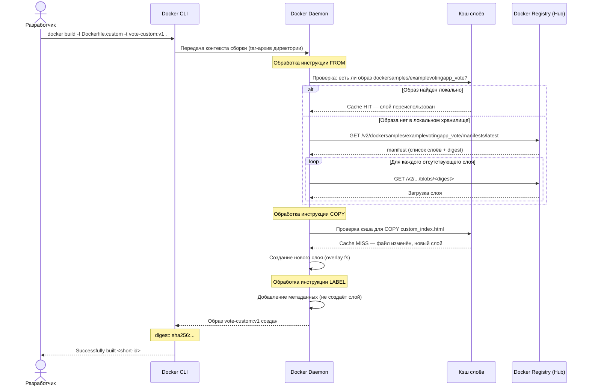
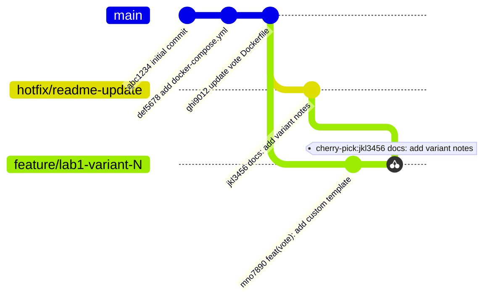
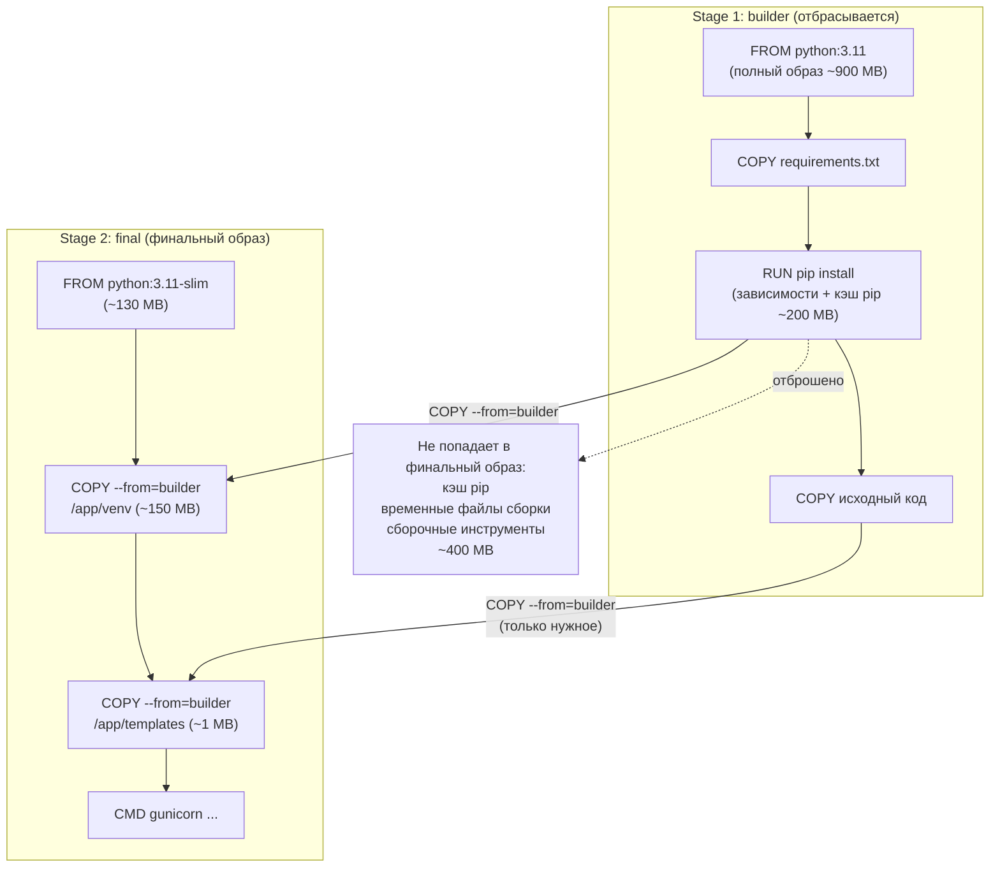

## Docker, Git и основы CI/CD — от теории к практике

## 1. Цель работы
Закрепить теоретические знания по темам лекций 1–4 раздела «Основы DevOps и управление разработкой»: получить практический опыт работы с Docker, Git и рабочими процессами разработки на примере реального многокомпонентного приложения.

Студент должен уметь:
- клонировать репозиторий и работать с историей изменений в Git;
- запускать многоконтейнерное приложение с помощью Docker Compose;
- анализировать образы и контейнеры Docker;
- вносить изменения в Dockerfile и собирать пользовательский образ;
- понимать принципы DevOps и жизненного цикла разработки ПО;
- строить технические диаграммы, описывающие архитектуру и процессы.
## 2. Варианты заданий
Каждый студент выполняет работу согласно своему варианту. Вариант определяет контейнер для детального исследования (задание 2) и URL-источник для встраиваемого iframe (задание 3).

| Вариант | Контейнер для inspect | iframe-источник для страницы vote                        |
| ------- | --------------------- | -------------------------------------------------------- |
| 1       | vote                  | https://ru.wikipedia.org/wiki/Docker                     |
| 2       | result                | https://docs.docker.com/get-started/                     |
| 3       | worker                | https://github.com/dockersamples/example-voting-app      |
| 4       | db                    | https://hub.docker.com/                                  |
| 5       | redis                 | https://12factor.net/                                    |
| 6       | vote                  | https://semver.org/lang/ru/                              |
| 7       | result                | https://keepachangelog.com/ru/1.0.0/                     |
| 8       | worker                | https://www.conventionalcommits.org/ru/v1.0.0/           |
| 9       | db                    | https://docs.github.com/en/actions                       |
| 10      | redis                 | https://about.gitlab.com/topics/ci-cd/                   |
| 11      | vote                  | https://trello.com/home                                  |
| 12      | result                | https://jira.atlassian.com/                              |
| 13      | worker                | https://www.atlassian.com/agile/scrum                    |
| 14      | db                    | https://www.atlassian.com/agile/kanban                   |
| 15      | redis                 | https://agilemanifesto.org/iso/ru/manifesto.html         |
| 16      | vote                  | https://git-scm.com/doc                                  |
| 17      | result                | https://www.gitflow.com/                                 |
| 18      | worker                | https://nvie.com/posts/a-successful-git-branching-model/ |
| 19      | db                    | https://docs.docker.com/compose/                         |
| 20      | redis                 | https://prometheus.io/docs/introduction/overview/        |
| 21      | vote                  | https://grafana.com/docs/grafana/latest/                 |
| 22      | result                | https://kubernetes.io/ru/docs/home/                      |
| 23      | worker                | https://www.jenkins.io/doc/                              |
| 24      | db                    | https://docs.ansible.com/                                |
| 25      | redis                 | https://www.terraform.io/intro                           |
| 26      | vote                  | https://www.linux.org/                                   |
| 27      | result                | https://nginx.org/ru/docs/                               |
| 28      | worker                | https://flask.palletsprojects.com/en/stable/             |
| 29      | db                    | https://www.postgresql.org/docs/                         |
| 30      | redis                 | https://redis.io/docs/                                   |
> **Примечание.** Если URL не открывается в iframe из-за политики X-Frame-Options, допускается замена на аналогичный ресурс — факт замены и причину необходимо зафиксировать в отчёте.
## 3. Подготовка рабочего окружения
### 3.1. Клонирование репозитория
Выполните клонирование репозитория example-voting-app в рабочий каталог:
```bash
git clone https://github.com/dockersamples/example-voting-app.git
cd example-voting-app
```
Исследуйте структуру репозитория и историю коммитов:
```bash
git log --oneline --graph --decorate --all | head -30
git branch -a
git tag
```
Зафиксируйте в отчёте: количество веток, тегов, авторов коммитов, дату последнего коммита. Опишите структуру каталогов (что находится в каждой директории).
### 3.2. Анализ docker-compose файлов
В репозитории присутствуют несколько Compose-файлов. Изучите их:
```bash
ls *.yml *.yaml
cat docker-compose.yml
```

Ответьте в отчёте на вопросы:
- Сколько сервисов описано в `docker-compose.yml`? Перечислите их.
- Какие порты проброшены на хост? Для каких сервисов?
- Какие зависимости между сервисами (`depends_on`)?
- Какие переменные окружения заданы? Для чего они нужны?
- Какие тома (volumes) используются и для чего?
- Для каких сервисов используется готовый образ (`image:`), а для каких — сборка из Dockerfile (`build:`)?
## 4. Задание 1: Запуск и исследование приложения
### 4.1. Запуск с помощью Docker Compose
Запустите приложение в фоновом режиме:
```bash
docker compose up -d
```
Дождитесь запуска всех контейнеров. Проверьте статус:
```bash
docker ps
docker compose ps
```
Скопируйте вывод обеих команд в отчёт. Обратите внимание на различие в отображаемой информации.
```bash
docker compose logs --tail=20
```
### 4.2. Исследование работоспособности приложения
Откройте в браузере интерфейс голосования (порт 5000) и интерфейс результатов (порт 5001). Проголосуйте за один из вариантов и убедитесь, что результат отображается на второй странице.

Для проверки сетевого взаимодействия выполните:
```bash
docker compose exec vote curl -s http://redis:6379 || true
docker compose exec worker env | sort
docker network ls
docker network inspect example-voting-app_front-tier
```

**В отчёте:**
- Приведите скриншот страницы голосования и страницы результатов после голосования.
- Сколько сетей создано? Какие контейнеры в какие сети входят?
- Опишите схему взаимодействия сервисов: как голос проходит путь от браузера до базы данных.

**Диаграмма 1 — архитектура и поток данных приложения**
Постройте диаграмму потока данных в приложении. Диаграмма должна отражать все сервисы, сети (`front-tier`, `back-tier`) и направления потоков данных. Включите в отчёт как исходный код диаграммы, так и её рендер (скриншот или экспорт из [mermaid.live](https://mermaid.live/)).

Ориентировочная структура — **доработайте и скорректируйте по реальным данным из `docker network inspect` и `docker compose ps`**:



**Вопросы к диаграмме (ответьте в отчёте):**
- Какие сервисы входят только во `front-tier`, какие — только в `back-tier`, а какие — в обе сети? Почему именно так разделены?
- Что произойдёт, если контейнер `redis` упадёт? Какие сервисы это затронет и почему?
- Как изменится диаграмма, если добавить балансировщик нагрузки перед сервисом `vote`?
### 4.3. Наблюдение за метриками во время работы
Запустите мониторинг ресурсов и сделайте скриншот:
```bash
docker stats --no-stream
```
Нагрузите приложение — несколько раз проголосуйте. Запустите stats повторно:
```bash
docker stats --no-stream
```

Сравните показатели CPU, памяти и сетевой активности до и после нагрузки. Какой контейнер потребляет больше всего памяти? CPU?
## 5. Задание 2: Детальное исследование контейнера (по варианту)
### 5.1. Сбор информации через docker inspect
Исследуйте контейнер, соответствующий вашему варианту:
```bash
docker inspect <имя_контейнера>
```
Извлеките и зафиксируйте в отчёте следующие сведения (используйте фильтрацию через `--format` или `jq`):
1. Идентификаторы: полный ID контейнера, короткий ID (первые 12 символов), Image ID.
2. Сетевые параметры: IP-адрес, MAC-адрес, сеть(и), шлюз, маска подсети.
3. Переменные окружения (Environment) — полный список.
4. Точка входа (Entrypoint) и команда запуска (Cmd).
5. Смонтированные тома и биндинги (Mounts).
6. Рабочая директория (WorkingDir) внутри контейнера.
7. Время создания контейнера (Created) и текущее состояние (State).
8. PID процесса внутри хост-системы (State.Pid).
9. Ограничения ресурсов (HostConfig): Memory, CpuShares, RestartPolicy.
10. Метки (Labels) образа и контейнера.

Пример команды для извлечения отдельного поля:
```bash
docker inspect --format '{{.NetworkSettings.IPAddress}}' <контейнер>
docker inspect <контейнер> | python3 -m json.tool | grep -A3 '"IPAddress"'
```
### 5.2. Исследование файловой системы контейнера
Подключитесь к контейнеру вашего варианта:
```bash
docker exec -it <контейнер> sh
```
Внутри контейнера выполните:
```bash
cat /etc/os-release
ps aux
ls -la /
df -h
```
Зафиксируйте результаты. Выйдите из контейнера: `exit`
### 5.3. Исследование образа
```bash
docker inspect <контейнер> --format '{{.Config.Image}}'
docker image inspect <образ>
docker image history <образ>
```

В отчёте зафиксируйте:
- Полное имя образа и его digest (sha256).
- Количество слоёв в образе и их суммарный размер.
- Команды, которые выполнялись при сборке каждого слоя (из history).
- Дату сборки образа.

**Диаграмма 2 — слоистая структура образа**
Постройте диаграмму, визуализирующую слои образа контейнера вашего варианта. Используйте вывод `docker image history` как единственный источник данных — **замените все placeholder-значения на реальные**. Каждый узел — один слой; направление — от базового к верхнему.



> Добавьте или уберите узлы в соответствии с реальным количеством слоёв. Укажите реальные размеры (поле SIZE из `docker image history`).

**Вопросы к диаграмме:**
- Какой слой самый «тяжёлый»? Почему именно он занимает больше всего места?
- Какие слои будут переиспользованы из кэша при повторной сборке, если изменить только исходный код приложения?
- Что произойдёт с кэшем, если поменять местами инструкции `COPY requirements.txt` и `RUN pip install`?
## 6. Задание 3: Модификация сервиса vote
### 6.1. Изучение оригинального Dockerfile
Перейдите в каталог сервиса vote:
```bash
cd vote/
cat Dockerfile
ls -la
```
 В отчёте:
- Какой базовый образ используется в оригинальном Dockerfile?
- Какие команды выполняются при сборке? В каком порядке?
- Какой порт экспонирует контейнер?
- Как запускается приложение (CMD/ENTRYPOINT)?
### 6.2. Модификация Dockerfile
Создайте новый Dockerfile с именем `Dockerfile.custom`. Используйте в качестве базового образа `dockersamples/examplevotingapp_vote` и добавьте страницу с iframe.
> **Не изменяйте оригинальный Dockerfile — работайте с копией Dockerfile.custom.**

Пример структуры `Dockerfile.custom`:
```dockerfile
FROM dockersamples/examplevotingapp_vote

COPY custom_index.html /app/templates/index.html

LABEL maintainer="student@university.ru"
LABEL lab.variant="<ваш вариант>"
```
### 6.3. Создание модифицированной страницы
Создайте файл `custom_index.html` на основе оригинального шаблона (`vote/templates/index.html`). Требования к странице:
- Страница должна сохранять оригинальную форму голосования.
- Iframe должен быть размещён ниже формы голосования, иметь ширину не менее 80% и высоту не менее 400px.
- Над iframe добавьте заголовок с описанием источника.
- Страница должна содержать ваши ФИО и вариант в комментарии HTML.

Пример фрагмента для вставки:
```html
<h3>Дополнительный материал по теме</h3>
<iframe src="<URL вашего варианта>"
        width="80%" height="400px"
        frameborder="0">
  <p>Ваш браузер не поддерживает iframe.</p>
</iframe>
```
### 6.4. Сборка и запуск модифицированного образа
```bash
docker build -f Dockerfile.custom -t vote-custom:v1 .
docker images | grep vote-custom
docker run -d -p 5002:80 --name vote-test vote-custom:v1
docker ps | grep vote-test
```
Откройте в браузере и убедитесь, что iframe отображается.
```bash
docker stop vote-test && docker rm vote-test
```
Для запуска через Compose — замените build-секцию сервиса `vote` в `docker-compose.yml`, указав `dockerfile: Dockerfile.custom`, и пересоберите:
```bash
docker compose up -d --build vote
```

**В отчёте приведите:**
- Полный текст `Dockerfile.custom`.
- Полный текст `custom_index.html`.
- Скриншот собранного образа (`docker images`) и запущенного контейнера.
- Скриншот страницы с отображённым iframe.

**Диаграмма 3 — процесс сборки образа (docker build)**
Постройте диаграмму последовательности (sequence diagram), описывающую процесс `docker build` от запуска команды сборки до появления готового образа. Диаграмма должна отражать взаимодействие: разработчик → Docker CLI → Docker Daemon → кэш слоёв → Docker Registry.




**Вопросы к диаграмме:**
- На каком шаге происходит проверка кэша? Какие инструкции Dockerfile инвалидируют кэш всех последующих слоёв?
- Что изменится в диаграмме при повторном запуске `docker build` без изменений в файлах?
- Что происходит с контекстом сборки (tar-архивом)? Почему `.dockerignore` важен для больших проектов?
## 7. Задание 4: Работа с Git — ветвление и история изменений
Это задание направлено на практическое применение материала лекции 4 (контроль версий и Git). Все действия выполняются в локальном репозитории example-voting-app.
### 7.1. Изучение истории репозитория
```bash
git log --oneline --graph --all
git log --stat --follow -- vote/Dockerfile
git log --format="%an" | sort | uniq -c | sort -rn
```
В отчёте:
- Как давно был создан репозиторий? Сколько всего коммитов?
- Перечислите 5 наиболее активных авторов.
- Как изменялся Dockerfile сервиса vote? Сколько раз он правился?
- Найдите коммит, в котором впервые появился docker-compose.yml:
```bash
git log --diff-filter=A -- docker-compose.yml
```
### 7.2. Создание ветки и фиксация изменений
```bash
git checkout -b feature/lab1-variant-<номер_варианта>
git add vote/Dockerfile.custom vote/custom_index.html
git status
git commit -m "feat(vote): add custom template with iframe for variant <N>"
git show HEAD
git log --oneline -5
```
### 7.3. Работа с тегами и сравнение версий
```bash
git tag -a v0.1-lab-variant<N> -m "Lab 1 submission, variant <N>"
git tag -l
git diff main -- vote/Dockerfile.custom vote/Dockerfile
```
Сохраните вывод `git diff` в отчёт.
### 7.4. Имитация командной работы: cherry-pick
Создайте вторую ветку от main:
```bash
git checkout main
git checkout -b hotfix/readme-update
echo "\n## Variant <N> notes\nCustom vote page added." >> README.md
git add README.md
git commit -m "docs: add variant notes to README"
```
Вернитесь в свою ветку и перенесите изменения из hotfix:
```bash
git checkout feature/lab1-variant-<N>
git cherry-pick hotfix/readme-update
git log --oneline -5
```
В отчёте: что такое cherry-pick и в каких ситуациях он используется? Чем отличается от merge?

**Диаграмма 4 — граф веток Git**
Постройте диаграмму, отображающую состояние репозитория после выполнения всех операций задания 4. Диаграмма должна показывать ветки `main`, `feature/lab1-variant-<N>`, `hotfix/readme-update` и операцию cherry-pick.

**Замените идентификаторы коммитов на реальные сокращённые хэши из вашего репозитория** (из вывода `git log --oneline`):



**Вопросы к диаграмме:**
- Чем `cherry-pick` отличается от `merge` визуально на графе веток?
- Что произойдёт с графом, если выполнить `git rebase main` на ветке `feature/...` вместо cherry-pick?
- В каком сценарии командной разработки использование `merge --no-ff` предпочтительнее `rebase`?
## 8. Задание 5: Исследование и оптимизация образа
### 8.1. Анализ размера образов
```bash
docker images | grep -E 'vote|result|worker|redis|postgres'
docker image history --no-trunc vote-custom:v1
docker inspect vote-custom:v1 --format '{{json .RootFS.Layers}}' | python3 -m json.tool
```
Запишите в отчёт: сколько слоёв в образе? Какой слой занимает больше всего места?
### 8.2. Предложение оптимизации
На основе анализа предложите и реализуйте конкретный способ уменьшения размера образа. Допустимые подходы (выберите один, обоснуйте выбор):
- Использование более компактного базового образа (например, переход на alpine-вариант).
- Объединение нескольких команд `RUN` в одну для сокращения числа слоёв.
- Применение многоэтапной (multi-stage) сборки.
- Добавление `.dockerignore` и исключение ненужных файлов из контекста сборки.
```bash
docker build -f Dockerfile.custom    -t vote-custom:v1     .
docker build -f Dockerfile.optimized -t vote-custom:v2-opt .
docker images | grep vote-custom
```

**В отчёте:**
- Опишите выбранный способ оптимизации и принцип его работы.
- Приведите полный текст `Dockerfile.optimized`.
- Сравните размеры образов v1 и v2-opt. Какой выигрыш в размере (в МБ и процентах)?
- Есть ли недостатки у выбранного подхода?

**Диаграмма 5 — сравнение стратегий сборки**
Постройте диаграмму, наглядно показывающую разницу между исходным подходом и выбранным способом оптимизации. Если вы использовали multi-stage сборку — покажите, что копируется из builder-стадии и что отбрасывается. Если другой подход — адаптируйте диаграмму под него.

Пример для multi-stage:



> Замените цифры на реальные размеры из вашего эксперимента.

**Вопросы к диаграмме:**
- Какова итоговая экономия в вашем эксперименте (МБ, %)?
- Есть ли у выбранного подхода недостатки (время сборки, сложность поддержки)?
- Когда multi-stage сборка неприменима или нецелесообразна?
### 8.3. Проверка работоспособности оптимизированного образа
```bash
docker run -d -p 5003:80 --name vote-opt vote-custom:v2-opt
```
Откройте `http://localhost:5003` и проверьте наличие iframe.
```bash
docker stop vote-opt && docker rm vote-opt
```
## 9. Теоретические вопросы к лабораторной работе
Ответы на вопросы включаются в письменный отчёт. Каждый ответ должен быть развёрнутым (не менее 5–7 предложений), **с примерами из выполненной работы**.
#### Блок А: Docker (лекция 4, практическая часть)
1. Что такое слой (layer) образа Docker? Почему Docker использует слоистую файловую систему? Назовите технологии Union FS, которые может использовать Docker. Как это влияет на эффективность хранения и передачи образов?
2. Чем образ (image) отличается от контейнера (container)? Объясните аналогию «образ — это класс, контейнер — это экземпляр». В каком состоянии может находиться контейнер?
3. Что такое digest образа (sha256)? Где вы его видели в ходе работы? Почему нельзя использовать только тег для обеспечения воспроизводимости сборки?
4. Что такое Docker API? Как Docker CLI взаимодействует с Docker daemon? Приведите пример прямого обращения к Docker API через `curl` или Python SDK.
5. Что такое Docker Registry? Чем отличается Docker Hub от приватного реестра? Каков процесс команды `docker pull`: откуда и как именно скачивается образ? Что происходит при команде `docker push`?
#### Блок Б: Git и DevOps (лекции 1–4)
6. Что такое DevOps? Перечислите его ключевые принципы согласно модели CALMS (Culture, Automation, Lean, Measurement, Sharing). Приведите пример каждого принципа применительно к проекту example-voting-app.
7. Опишите жизненный цикл разработки ПО (SDLC). Какие стадии вы наблюдаете в репозитории example-voting-app (в истории коммитов, CI-файлах, тегах)?
8. Что такое система управления задачами? Какие инструменты относятся к этой категории? Как организация задач связана с ветками в Git (Git Flow, Trunk-based development)?
9. Объясните разницу между `merge` и `rebase`. Когда предпочтительнее использовать каждый из подходов? Что произошло при выполнении cherry-pick в задании 4.4?
10. Что произойдёт при выполнении `git pull --rebase` вместо обычного `git pull`? Почему команды `git reset --hard` и `git push --force` считаются опасными в командной работе?
#### Блок В: Архитектура и инфраструктура
6. Опишите архитектуру example-voting-app: какие сервисы входят в состав приложения, на каком языке написаны, какую роль выполняют? Соотнесите свой ответ с **диаграммой 1** из задания 1.
7. Что такое Docker Compose? В чём разница между `docker-compose.yml` и `Dockerfile`? Для каких сред (разработка, staging, production) Compose является подходящим инструментом, а для каких — нет?
## 10. Требования к отчёту
Отчёт оформляется в формате PDF или DOCX и должен содержать следующие разделы:
1. **Титульный лист:** дисциплина, тема работы, ФИО студента, группа, вариант, дата.
2. **Задание 1:** скриншоты `docker ps` / `docker compose ps`, **диаграмма 1** (архитектура), ответы на вопросы.
3. **Задание 2:** вывод `docker inspect` (основные поля), **диаграмма 2** (слои образа), вывод `docker image history`.
4. **Задание 3:** текст `Dockerfile.custom`, текст `custom_index.html`, **диаграмма 3** (процесс сборки), скриншоты.
5. **Задание 4:** скриншоты `git log`, **диаграмма 4** (граф веток), вывод `git diff`, ответ про cherry-pick.
6. **Задание 5:** сравнительная таблица размеров образов, `Dockerfile.optimized`, **диаграмма 5** (сравнение стратегий).
7. **Теоретические вопросы** (блоки А, Б, В).
8. **Вывод:** что было изучено, какие трудности возникли, что было наиболее интересным.

> **Отчёты, содержащие ответы, очевидно сгенерированные нейросетью без понимания** (отсутствие ссылок на конкретные команды/скриншоты из работы, шаблонные фразы, диаграммы с placeholder-данными вместо реальных), **будут возвращены на доработку.**
## 12. Рекомендации и типичные ошибки
### Что проверять, если что-то не работает
- Контейнер не запускается — проверьте `docker compose logs <сервис>` на наличие ошибок.
- iframe не отображается — сайт может блокировать встраивание через X-Frame-Options; попробуйте другой URL и зафиксируйте причину.
- `docker exec` возвращает ошибку — возможно, в образе нет `sh` или `bash`; используйте `docker exec <контейнер> ls /`.
- `git push` требует удалённый репозиторий — для локальной работы `git push` не нужен; все задания выполняются в локальном репозитории.
- Ошибка при сборке образа — проверьте, что вы находитесь в каталоге `vote/` и файл `Dockerfile.custom` существует.
- Mermaid не рендерится — используйте [mermaid.live](https://mermaid.live/), VS Code с расширением Markdown Preview Mermaid, GitLab или GitHub.
### Типичные ошибки в отчёте
- Копирование вывода команд без анализа — объясняйте каждый результат.
- Отсутствие скриншотов — без визуального подтверждения работа не засчитывается.
- Диаграммы с шаблонными данными вместо реальных — замените все `<placeholder>`-значения на данные из своего репозитория.
- Ответы на теоретические вопросы без привязки к практике — ссылайтесь на конкретные наблюдения из заданий.
- Нарушение формата коммит-сообщения — используйте Conventional Commits (`feat:`, `fix:`, `docs:` и т.д.).
## 13. Полезные ресурсы
- Документация Docker: https://docs.docker.com/
- Справочник команд Docker CLI: https://docs.docker.com/engine/reference/commandline/cli/
- Репозиторий example-voting-app: https://github.com/dockersamples/example-voting-app
- Git Reference: https://git-scm.com/doc
- Conventional Commits: https://www.conventionalcommits.org/ru/v1.0.0/
- The Twelve-Factor App: https://12factor.net/
- Docker multi-stage builds: https://docs.docker.com/develop/develop-images/multistage-build/
- Mermaid — онлайн-редактор диаграмм: https://mermaid.live/
- Mermaid — документация: https://mermaid.js.org/intro/